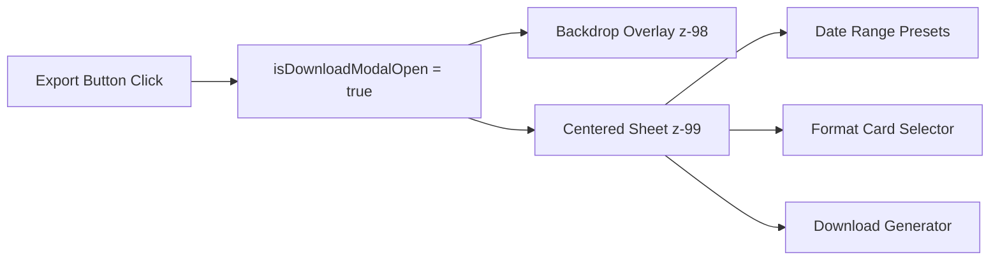
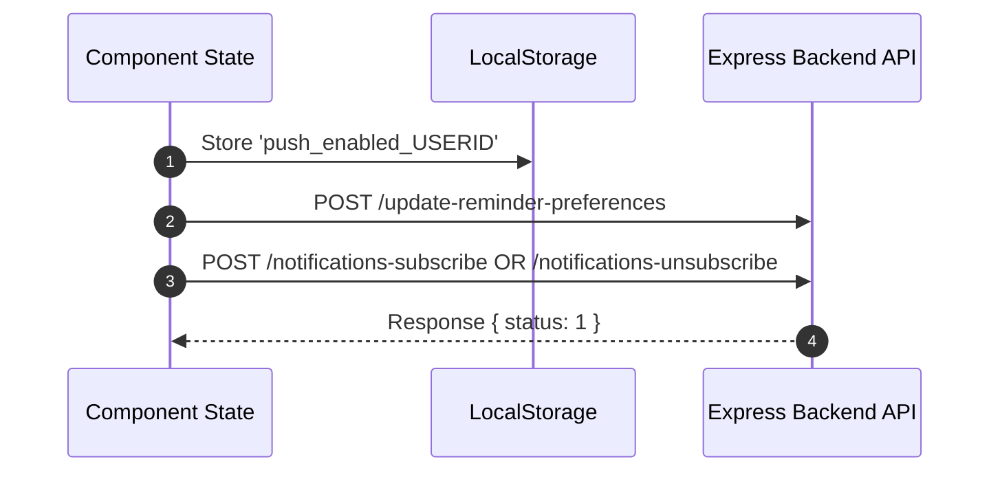

# 📋 Rules: Export Modals, Push Notifications & ChatGPT Integration

> [!IMPORTANT]
> These rules must be strictly followed when editing or creating features involving Export Modals, Push Notifications, or ChatGPT AI prompts in the SadhanaGPT repository.

---

## 1. Export Modal Standards

### UI Layout & Responsiveness
1. **Container Styling**: All Export modals must use a bottom-sheet presentation on mobile with dark backdrop overlay (`fixed inset-0 bg-black/40 backdrop-blur-sm z-[98]`) and flexbox centered bottom sheet (`relative w-full max-w-md mx-auto bg-white dark:bg-[#0F172A] rounded-t-[32px]`).
2. **Never Use Fragile Inline Offsets**: Do NOT use `right: max(0px, calc(50% - 224px))` or fragile pixel offsets that break rendering on direct page refreshes.



### Date Range & Preset Behavior
- **Presets**: Provide `7 Days`, `30 Days`, and `Custom` buttons.
- **Conditional Visibility**: Custom `From Date` and `To Date` inputs **MUST BE VISIBLE ONLY** when `exportDuration === 'custom'`.
- **Validation**: If `Custom` is selected, ensure start and end dates are selected before generating export files.

### Required State Variables
Every component mounting an Export modal must declare and maintain the following state:
```javascript
const [exportDuration, setExportDuration] = useState('7');
const [exportStartDate, setExportStartDate] = useState('');
const [exportEndDate, setExportEndDate] = useState('');
const [exportFormat, setExportFormat] = useState('EXCEL'); // 'EXCEL' | 'PDF'
const [isDownloadModalOpen, setIsDownloadModalOpen] = useState(false);
```

---

## 2. Push Notification Preference Rules

### Two-Way State Synchronization
When toggling notification preferences:
1. **Local State**: Update React state (`setIsPushEnabled(true/false)`).
2. **Browser Storage**: Persist state to `localStorage.setItem('push_enabled_' + userId, 'true'/'false')`.
3. **Backend API**:
   - Enabling: Call `/update-reminder-preferences` (`reminder_enabled: true`) and `/notifications-subscribe`.
   - Disabling: Call `/update-reminder-preferences` (`reminder_enabled: false`) and `/notifications-unsubscribe`.



### Preference Check Rule
- When checking subscription status via `/check-push-status`:
  - **Respect User Disable Action**: If `localStorage` explicitly contains `'false'`, do NOT allow server response to force `setIsPushEnabled(true)`.

---

## 3. ChatGPT AI Redirect Rules

1. **Use Central Helper**: Always use `openChatGPTWithPrompt(fullPrompt, newWin)` from `src/utils/chatGptUtils.js`. Do not write custom `window.open('https://chatgpt.com/?q=...')` calls directly in components.
2. **Auto-Submit Parameter**: Ensure URLs use `https://chatgpt.com/?hints=search&q=${encodeURIComponent(promptText)}`.
3. **Clipboard Backup**: `openChatGPTWithPrompt` must automatically execute `navigator.clipboard.writeText(fullPrompt)` to ensure the user has a local fallback.
4. **URL Length Safeguard**: Truncate URL query parameters if prompt length exceeds 7000 characters to prevent browser URL limit truncation crashes.
