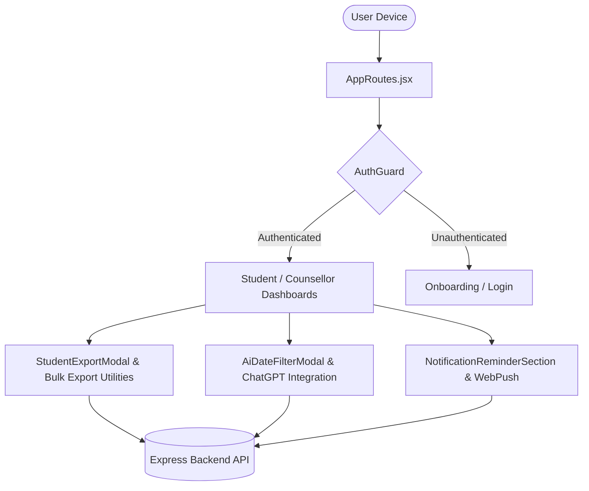
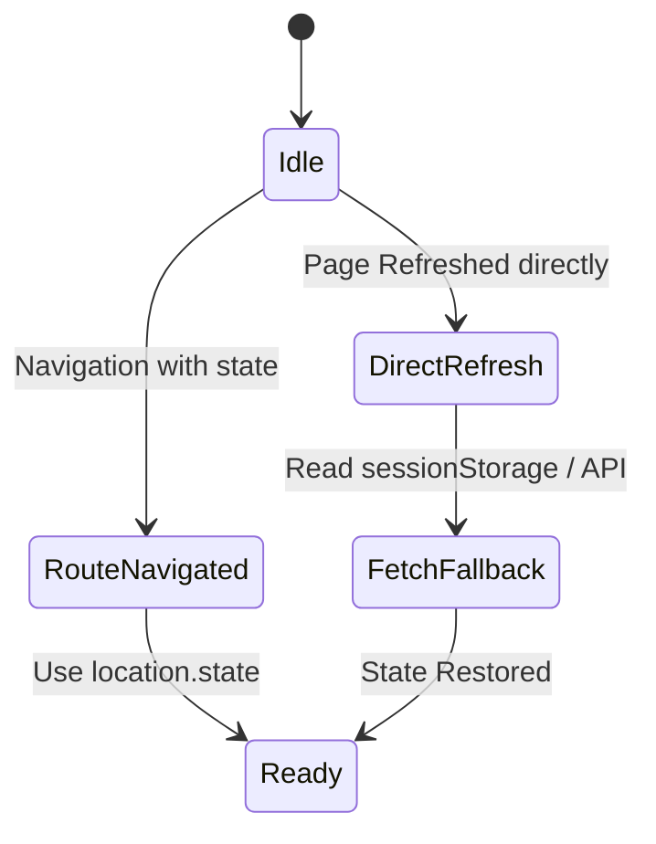

# 📐 Project Standards & Preservation Rules

These rules are strictly enforced for all modifications to the **SadhanaGPT React Web App** project.

---

## 🏗️ System Architecture Overview

---

## 1. UI Integrity & Preservation
- **NEVER** delete, hide, or remove existing UI modules, modals, or user-facing functionality unless the USER explicitly requests it (e.g., Mentee Labels module).
- If a component must be temporarily refactored, it **MUST** be fully restored and connected to its corresponding backend API before declaring completion.
- Always check for existing components in `src/components/` or `src/utils/` before creating new ones to prevent code duplication.

---

## 2. Design System & Aesthetics
- The application uses a premium modern dark/light aesthetic (glassmorphism, vibrant accents, smooth Framer Motion micro-animations).
- All buttons and interactive cards must feature `active:scale-95 transition-all` or equivalent tactile feedback.
- Use predefined Tailwind color classes (`bg-blue-600`, `dark:bg-[#0F172A]`, `border-slate-700`) rather than ad-hoc inline styles.

---

## 3. Modal Presentation & Centering
- Modals must be centered using standard Flexbox layout (`fixed inset-0 z-[60] bg-black/60 backdrop-blur-md flex items-end sm:items-center justify-center`).
- Avoid fragile CSS inline right offsets (`right: max(0px, calc(50% - 224px))`) which lead to off-screen modal clipping on viewport updates or direct page refreshes.

---

## 4. State Management & Offline Fallbacks
- Page refresh without location state (e.g., opening `http://localhost:5173/counsellor/group-mentees` directly) must gracefully fallback to fetching user defaults (e.g. `/group-list`) or restoring state from `sessionStorage`.
- Perform state checks (`useState`, `useEffect`) to ensure modal input fields (like `exportFormat`, `exportDuration`) are fully declared before mounting modal JSX.

---

## 5. API Response Normalization
- All HTTP requests must go through `src/services/api.js`.
- Always normalize responses with `processResponse` from `src/utils/apiUtils.js` to ensure uniform `{ status, message, data }` structures.

---

## 6. Rules Reference
- Refer to `.agents/rules/export-and-ai-rules.md` for specific Export, Notification, and AI prompt rules.
