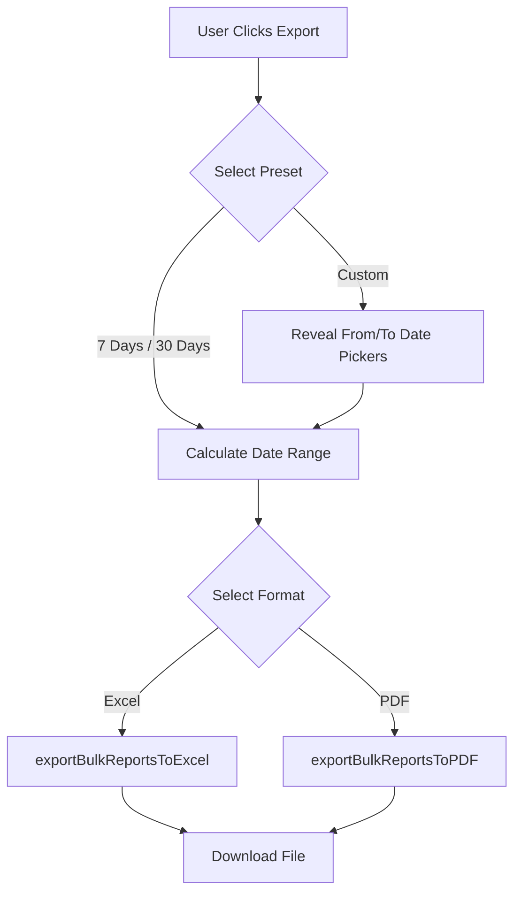
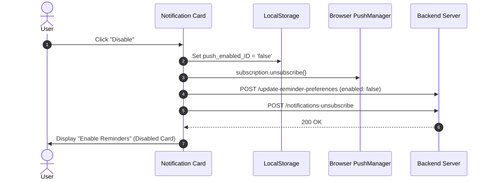

# 📜 Changelog - SadhanaGPT React Web

All notable changes, UI redesigns, architectural updates, and bug fixes for the **SadhanaGPT React Web App** are documented in this file.

---

## ↩️ [Revert] - 2026-10-04, 12:20 PM IST

- **Developer**: Manvatar Prabhu Ji
- **What changed**: Undid the "New meditation app icon" change. The app icon, browser tab icon and notification icon are back to the original smiling-face logo.
- **Files touched**: `public/icon-192.png`, `public/icon-512.png`, `public/icon-maskable-192.png`, `public/icon-maskable-512.png`, `public/apple-touch-icon.png`, `public/favicon.png`, `public/favicon.svg`, `CHANGELOG.md`

---

## ✏️ [Change] - 2026-10-04, 12:10 PM IST

- **Developer**: Manvatar Prabhu Ji
- **What changed**: New app icon for everyone (students and counsellors): a white meditating figure with a soft glow on a saffron background, replacing the old face logo. It is used for the home-screen/installed app icon, the browser tab icon and the notification icon. Same pictures, same file names, nothing else changed.
- **Files touched**: `public/icon-192.png`, `public/icon-512.png`, `public/icon-maskable-192.png`, `public/icon-maskable-512.png`, `public/apple-touch-icon.png`, `public/favicon.png`, `public/favicon.svg`, `CHANGELOG.md`

---

## ✏️ [Change] - 2026-10-04, 11:55 AM IST

- **Developer**: Manvatar Prabhu Ji
- **What changed**: The "Export Data" tile on the counsellor Analytics screen now shows a download icon instead of the gear (settings) icon.
- **Files touched**: `src/pages/counsellor/CounsellorAnalytics.jsx`, `CHANGELOG.md`

---

## ✏️ [Change] - 2026-10-04, 11:40 AM IST

- **Developer**: Manvatar Prabhu Ji
- **What changed**: On the counsellor Analytics screen, the "Report Settings" tile is now called "Export Data", and the pop-up it opens now has the heading "Export Data". Only the name changed; what it does is the same.
- **Files touched**: `src/pages/counsellor/CounsellorAnalytics.jsx`, `src/components/counsellor/ReportSettingsModal.jsx`, `CHANGELOG.md`

---

## 🐛 [Fix] - 2026-10-04, 11:15 AM IST

- **Developer**: Manvatar Prabhu Ji
- **What changed**: The bird's-eye, mic and marks icons could overlap or sit out of line after a reload, because the spot each one was dragged to was saved in the phone's browser and then applied to a newer layout. Dragged positions are no longer saved: after a reload (or reopening the app) the three icons start again aligned in one vertical line. While moving between pages inside the app, an icon keeps the spot it was dragged to. Old saved positions are cleaned out automatically.
- **Files touched**: `src/components/shared/DraggableFloating.jsx`, `CHANGELOG.md`

---

## ✨ [Feature] - 2026-10-04, 10:55 AM IST

- **Developer**: Manvatar Prabhu Ji
- **What changed**: On the counsellor "Custom Activities" screen, when a built-in activity (like chanting) is removed from "Already added" (after the confirmation), it now stays on screen in RED with a "+" next to it. Tapping the "+" adds the activity back to that group or sub-group for the students. Custom activities behave as before (they move to Available). The red state is remembered only on this screen: it is forgotten if the page is reloaded.
- **Files touched**: `src/pages/counsellor/activites/custom-activities/CustomActivities.jsx`, `CHANGELOG.md`

---

## 🐛 [Fix] - 2026-10-04, 10:40 AM IST

- **Developer**: Manvatar Prabhu Ji
- **What changed**: On the counsellor "Custom Activities" screen, after selecting an available activity the "Assign Activities" bar was pushed half off the right edge of a phone screen, so the Assign button was hard to see and tap (people kept tapping its edge). The bar is now centred, fully visible and sits above the bottom menu. The Assign button also now shows "Assigning..." and ignores extra taps while the request is running, so the same request is not sent several times.
- **Files touched**: `src/pages/counsellor/activites/custom-activities/CustomActivities.jsx`, `CHANGELOG.md`

---

## ✨ [Feature] - 2026-10-03, 10:25 PM IST

- **Developer**: Manvatar Prabhu Ji
- **What changed**: On the counsellor side, in "Mentees & Group Management", after selecting students and tapping Export, the pop-up is now the same as the other export pop-ups: choose 7 Days / 30 Days / Custom dates, and choose Excel or PDF. Before, it was a plain list (Excel / CSV / PDF) that always exported the full history with no date choice. The export now uses the chosen date range for only the selected students.
- **Files touched**: `src/pages/counsellor/mentees_module/MenteesList.jsx`, `CHANGELOG.md`

---

## 🐛 [Fix] - 2026-10-03, 10:05 PM IST

- **Developer**: Manvatar Prabhu Ji
- **What changed**: When the bell button is tapped (student and counsellor side), the panel now opens on the Rankings tab, with Group Rank selected and Previous Day selected, instead of Updates / Today. It resets to this every time the panel is closed and opened again. People can still switch to Updates, Global Rank, Today or Last 1 Week.
- **Files touched**: `src/components/shared/NotificationsPanel.jsx` (shared by all bell panels), `CHANGELOG.md`

---

## ✨ [Feature] - 2026-10-03, 09:50 PM IST

- **Developer**: Manvatar Prabhu Ji
- **What changed**: On the counsellor side, the "My Sadhana" analytics screen (opened from the analytics icon on the home page) now has a green EXPORT button next to AI ANALYSIS, exactly like the student side. It opens the same export pop-up (7 Days / 30 Days / Custom, Excel or PDF, share). It exports the counsellor's own personal sadhana.
- **Files touched**: `src/pages/counsellor/PersonalSadhanaAnalytics.jsx`, `CHANGELOG.md`

---

## 🐛 [Fix] - 2026-10-03, 09:35 PM IST

- **Developer**: Manvatar Prabhu Ji
- **What changed**: Safety net for counsellors who installed the app BEFORE the PWA fix. Their installed icon still opens the student dashboard launch address. Now, only when that exact launch address (`?assistant=open`) is opened by a logged-in counsellor, they are sent to the counsellor dashboard. Students and normal visits are not affected. Works immediately after deploy, with no reinstall.
- **Files touched**: `src/pages/student/StudentDashboard.jsx`, `CHANGELOG.md`

---

## 🐛 [Fix] - 2026-10-03, 09:20 PM IST

- **Developer**: Manvatar Prabhu Ji
- **What changed**: When a counsellor installed the app on their phone (PWA) and opened it, it opened the student screen. The installed app was told to always start on the student dashboard. Now it starts at the login page address, which sends each logged-in person to their own dashboard: counsellors go to the counsellor dashboard, students to the student dashboard (with the Sadhna assistant opened, as before). Phones that already installed the app may need a few days to pick this up, or the app can be removed and installed again.
- **Files touched**: `public/manifest.webmanifest`, `src/pages/Login.jsx`, `src/components/student/SadhnaAssistantLauncher.jsx` (comment only), `CHANGELOG.md`

---

## ✨ [Feature] - 2026-10-03, 09:45 PM IST

- **Developer**: Manvatar Prabhu Ji
- **What changed**: The bird's-eye icon, the mic icon (opens the Sadhna bot) and the marks icon are now all the same size (the size the marks circle used to be: 68px on phones, 76px on large screens), sit in one straight vertical line (bird on top, mic in the middle, marks at the bottom) and can be moved: press, hold and drag them anywhere on the screen. A simple tap still works as before, and dropping an icon after a drag does not open it. Icons stay fully on screen and above the bottom menu, and each icon remembers where it was left (on that device). The marks card now opens to the side/below when the icon is near a screen edge so it is never cut off.
- **Files touched**: `src/components/shared/DraggableFloating.jsx` (new), `src/components/counsellor/BirdsEyeFab.jsx` (new), `src/components/student/SadhnaAssistantLauncher.jsx`, `src/components/shared/DailyScoreIndicator.jsx`, `src/pages/counsellor/CounsellorDashboard.jsx`, `CHANGELOG.md`

---

## 🐛 [Fix] - 2026-10-03, 08:50 PM IST

- **Developer**: Manvatar Prabhu Ji
- **What changed**: The chatbot microphone now uses the browser's own voice typing on every device (Android, iPhone, desktop). It no longer records audio and sends it to our server, which was failing with an error right after tapping Stop. Spoken words now appear in the box while speaking. The mic closes by itself when you stop talking, after 60 seconds at most, or when you tap it again. If a browser does not support voice typing, the mic button is hidden and the user types instead.
- **Files touched**: `src/sadhna-assistant/components/NLInputBar.jsx`, `CHANGELOG.md`

---

## 🧪 [Test] - 2026-10-03, 06:52 PM IST

- **Developer**: Manvatar Prabhu Ji
- **What changed**: Added a temporary test. A browser alert saying "hello from claude" now shows when the login page (`/`) opens. Remove after testing.
- **Files touched**: `src/pages/Login.jsx`, `CHANGELOG.md`

---

## 🚀 [v1.2.0] - 2026-09-27

### 🎨 Features & Redesigns

#### 1. Export Students Modal Redesign
- **Unified Bottom-Sheet Interface**: Replaced outdated inline export dialogs with a modern glassmorphism bottom-sheet modal across:
  - Student Analytics (`/student/analytics`)
  - Counselor Analytics & Report Settings (`/counsellor/analytics`)
  - Counselor Group Mentees (`/counsellor/group-mentees`)
- **Preset & Custom Date Controls**: Added quick date preset chips (`7 Days`, `30 Days`, `Custom`).
- **Conditional Custom Date Pickers**: `From Date` and `To Date` inputs are smoothly revealed **only when `Custom` date preset is selected** via Framer Motion `<AnimatePresence>`.
- **Card-Based Format Selection**: Interactive option cards for **Excel (`.xlsx`)** and **PDF (`.pdf`)** export with active state indicators and descriptions.

---

### 🐛 Bug Fixes & Stability

#### 1. Group Mentees Route Export Crash Fix
- **Issue**: Refreshing `http://localhost:5173/counsellor/group-mentees` and clicking Export rendered a blank screen.
- **Root Cause**: `exportFormat` and `setExportFormat` were referenced in the export modal JSX but missing from state declarations in `GroupMenteesList.jsx`, causing an uncaught `ReferenceError`.
- **Fix**: Declared `const [exportFormat, setExportFormat] = useState('EXCEL')` and added fallback center auto-fetch (`/group-list`) when refreshing without location state.

#### 2. Push Notification Preference Persistence Sync
- **Issue**: Disabling push notifications on the dashboard automatically flipped back to "Reminders Enabled" upon page refresh or background status checks.
- **Root Cause**: Disabling push notifications locally unsubscribed browser WebPush but did not notify the backend server (`/update-reminder-preferences`, `/notifications-unsubscribe`), leading `/check-push-status` to return `isSubscribed: true`.
- **Fix**:
  - Updated `handleDisableNotifications` in `NotificationReminderSection.jsx` to call `/update-reminder-preferences` (`reminder_enabled: false`, `reminder_status: 0`) and `/notifications-unsubscribe`.
  - Updated `checkSubscription` in `StudentDashboard.jsx` and `CounsellorDashboard.jsx` to strictly preserve local `localStorage.getItem('push_enabled_' + userId) === 'false'`.

#### 3. Standardized ChatGPT Integration & Auto-Clipboard Copy
- **Issue**: Direct URL navigation to ChatGPT (`chatgpt.com/?q=...`) left raw prompt text sitting in the bottom input box after auto-submitting.
- **Fix**:
  - Updated `openChatGPTWithPrompt` in `chatGptUtils.js` to use `https://chatgpt.com/?hints=search&q=...` for automatic query submission.
  - Added automatic **Clipboard Copy** (`navigator.clipboard.writeText`) on redirect so the user always has a local backup copy of the prompt.
  - Standardized ChatGPT redirection across `GroupMenteesList`, `MenteesList`, `CounsellorAnalytics`, `StudentReport`, and `AIChat`.

---

## 🛠️ [v1.1.0] - 2026-09-20

### 🌟 Added
- Counselor Group & Sub-Group management modules.
- Multi-mentee bulk Sadhana analysis with ChatGPT AI prompt construction.
- Responsive mobile bottom navigation bars (`StudentBottomNavigation` & `CounsellorBottomNavigation`).

---

## 📌 Maintenance Notes
- Always run `cmd /c npm run build` to verify production compilation after modifying modals or state hooks.
- Refer to `.agents/rules/project-standards.md` for coding conventions and state preservation rules.
