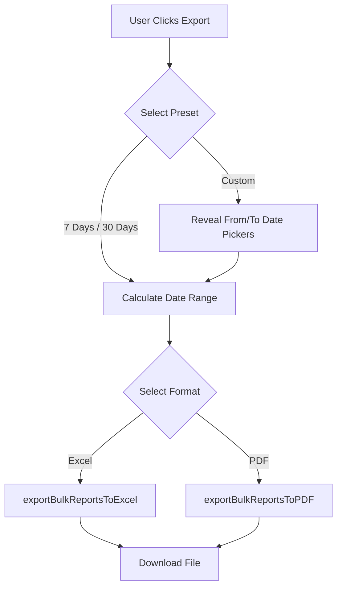
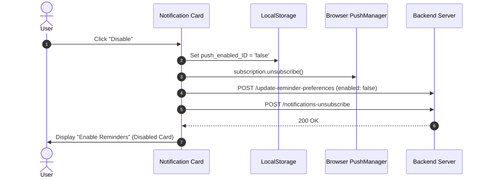

# 📜 Changelog - SadhanaGPT React Web

All notable changes, UI redesigns, architectural updates, and bug fixes for the **SadhanaGPT React Web App** are documented in this file.

---

## 🔌 [Reading Lecture Feature] - 2026-10-09, 06:46 PM IST

- **Developer**: Manvatar Prabhu Ji
- **What changed**: The books and lectures screens can now use REAL data from the server. New live pages: `/student/reading` (a person's own reading list and lectures: tap a status, add own book, tick a lecture, add own lecture, Hindi/English) and `/counsellor/reading` (pick group / sub-group, change order and save, reset to default, mentee status, edit lecture list incl. Excel upload, mentee lectures). Both are opened by typing the address (not in any menu yet). The old preview pages still work with sample data, and the sample list now shows the real 54 books with Hindi names instead of 7 placeholder books. The screens are shared between preview and live, only the data source differs.
- **Files touched**: `src/reading-lecture-feature/` (new: `api.js`, `mappers.js`, `useReadingLectureStore.js`, `useCounsellorTools.js`, `useMockCounsellorTools.js`, `ReadingLecturePageView.jsx`, `ReadingLectureLivePage.jsx`, `CounsellorReadingLecturePageView.jsx`, `CounsellorReadingLivePage.jsx`; changed: `ReadingLecturePage.jsx`, `CounsellorReadingLecturePage.jsx`, `data/mockData.js`, `README.md`, and the windows in `components/`), `src/routes/AppRoutes.jsx` (two new routes), `CHANGELOG.md`. No new packages.
- **Tested**: build passes, lint clean for the feature. In a real browser (phone size) against the real backend code on a throwaway local database: student page (status change saved with dates, own book, lecture tick, typed lecture, Hindi) and counsellor page (group pick, add book + save as custom list, mentee status, Excel upload of 3 lectures + save, mentee lectures window) all worked with no page errors. NOT tested: on the real test site, with real logins, on a real phone.
- **Backend**: needs the 14 new routes deployed and the two SQL scripts run (see the backend `README.md` in `SadhanaGPT/reading-lecture-feature`).

## 🧑‍🏫 [Reading Lecture Feature] - 2026-10-09, 04:50 PM IST

- **Developer**: Manvatar Prabhu Ji
- **What changed**: First look at the COUNSELLOR screens for books and lectures, with sample data only (nothing is saved, nothing talks to the server or database). Open it by typing `/counsellor/reading-preview` (not linked from any menu yet). Same Reading / Lectures tabs as students, plus a box at the top, "Reading Order/Status for Mentees" (and "Lectures for Mentees"), where the counsellor picks All groups / one group / one sub-group and sees whether that scope uses the DEFAULT or a CUSTOM list. Reading: "Change order" opens a window to re-order books (drag on a computer, or the up/down arrows on a phone; a book can move to another level), "+" on each level to add a book (from the library or a new name; author starts as Srila Prabhupada), add or rename levels, remove books, "Reset to default list", and "Save for mentees". "Mentee status" shows each mentee's completed books and status (filters: reading now, ongoing 30+ days, not started; a "By book" view with counts; mentees' own added books are marked). Lectures: "Edit lecture list" (add one lecture, re-order, remove, or "Upload Excel" with columns Title, Speaker, Link: a preview shows how many rows are ready and why others are skipped, plus "Download sample Excel"), and "Mentee lectures" shows what each mentee heard. The counsellor's own reading/lecture list appears below, same as a student's.
- **Files touched**: `src/reading-lecture-feature/` (new: `CounsellorReadingLecturePage.jsx`, `data/mockCounsellor.js`, `components/ScopePicker.jsx`, `CustomiseOrderWindow.jsx`, `MenteeStatusWindow.jsx`, `MenteeLecturesWindow.jsx`, `LectureListEditor.jsx`; small additions to `components/ui.jsx`), `src/routes/AppRoutes.jsx` (one new route), `CHANGELOG.md`. No new packages: the Excel library already in the website is loaded only when someone uploads or downloads an Excel file.
- **Tested**: the website builds; lint is clean for the new folder. In a real browser at phone size I tried: choosing group and sub-group, moving a book to another level, adding a book, saving, the mentee status window (both views), adding lectures from an uploaded .xlsx (3 rows accepted; a row with no title and a row with a bad link were skipped with the reason shown), saving, and the mentee lectures window: no errors. NOT tested: on a real phone, with real data, drag-and-drop by touch (the arrows are the phone method), or the Excel download button. The mentee status window shows the default book list for every scope for now (the real version will follow each scope's own list).
- **Backend**: nothing yet.

## 📖 [Reading Lecture Feature] - 2026-10-09, 04:10 PM IST

- **Developer**: Manvatar Prabhu Ji
- **What changed**: First look at the STUDENT screens for books and lectures, using sample data only (nothing is saved and nothing talks to the server or database). Open it by typing the address `/student/reading-preview` (not linked from any menu yet, so no student sees it). Two tabs: Reading (summary card with books completed and progress bar, levels that open and close with the current level open, tap a status chip to go Not started -> Ongoing -> Completed with a short Undo, a menu to Skip / Bring back a book, "My other books" with "+ Add a book I am reading" (author starts as Srila Prabhupada), a skipped-books list, a NEW badge on recently added books) and Lectures (recommended list with a tick for "heard", NEW badge, "Lectures I heard" log, "+ Add a lecture I heard" with title, speaker, link and date). A button switches book and level names between English and Hindi.
- **Files touched**: `src/reading-lecture-feature/` (new: `ReadingLecturePage.jsx`, `useMockStore.js`, `data/mockData.js`, `components/ReadingTab.jsx`, `components/LecturesTab.jsx`, `components/ui.jsx`), `src/routes/AppRoutes.jsx` (one new route), `CHANGELOG.md`
- **Tested**: the website builds, lint is clean for the new folder; I opened the screens in a browser at phone size and tried the taps (status chip, add book, add lecture, Hindi switch): no errors. NOT tested: on a real phone, with real data, or in the dark theme (the page is light only, like the Inspiration page). The sample lectures are made-up titles with no links.
- **Backend**: nothing yet (a later step will connect this to the new tables).

## 📚 [Reading Lecture Feature] - 2026-10-09, 02:45 PM IST

- **Developer**: Manvatar Prabhu Ji
- **What changed**: Created a new folder `src/reading-lecture-feature/` (with a short README) where all new work for the reading-lecture feature will go. Nothing is built yet and no existing behaviour changes. A matching folder was made in the other repo (backend `SadhanaGPT/reading-lecture-feature/`).
- **Files touched**: `src/reading-lecture-feature/README.md` (new), `CHANGELOG.md`
- **Tested**: not needed (no code); the folder is not used by anything yet.
- **Backend**: no change needed.

## 📱 [Counsellor Dashboard] - 2026-10-08, 01:40 PM IST

- **Developer**: Manvatar Prabhu Ji
- **What changed**: On phones, the "Students Rank" and red "Students Need Follow-up" cards were side by side and the follow-up card was pushed off the right edge of the screen (the page scrolled sideways, about 507px wide on a 360px phone). Now, on phones, the two cards stay side by side in one row that the counsellor swipes left/right (each card is about 3/4 of the screen wide, so the second card peeks in from the right, and the row snaps to a card when you let go). On tablets and computers (640px and wider) they just sit side by side as before, no scrolling. The page itself no longer scrolls sideways.
- **Files touched**: `src/pages/counsellor/CounsellorAnalytics.jsx`, `CHANGELOG.md`
- **Tested**: I rebuilt just these two cards with the site's real styles and made screenshots at 320, 360 and 390 px wide: before = follow-up card cut off and page 507px wide; after = Students Rank fully visible with the follow-up card peeking in, swipe reveals it, and the page itself does not scroll sideways; at 800px both sit side by side. Website builds; lint problems unchanged (10 before, 10 after). NOT tested with real data on a real phone: please open the dashboard on your phone after deploy.
- **Backend**: no change needed.

## 👥 [Counsellor Profile] - 2026-10-08, 12:40 PM IST

- **Developer**: Manvatar Prabhu Ji
- **What changed**: On the counsellor Profile page, a new "Add Mentees" section sits just above "My Mentors" (where mentors are added). It says "Please share this link with mentees to join your group.", shows the counsellor's invite link, and has two small icons right next to the link: copy and share (share opens WhatsApp etc. on phones; on computers Share copies the link). The link is the same one the dashboard Invite button uses. The link-building, copy and share code now lives in one small shared file (`src/utils/inviteLink.js`) used by both places; the dashboard Invite button behaves as before.
- **Files touched**: `src/pages/counsellor/CounsellorProfile.jsx`, `src/pages/counsellor/CounsellorAnalytics.jsx`, `src/utils/inviteLink.js` (new), `CHANGELOG.md`
- **Tested**: the website builds; lint problems unchanged (Profile 6, Dashboard 10, none new). NOT tested on a real phone/screen: please open Profile as a counsellor on the test site, check the section looks right, and try Copy link and Share.
- **Backend**: no change needed.

## 📨 [Counsellor Dashboard] - 2026-10-08, 12:25 PM IST

- **Developer**: Manvatar Prabhu Ji
- **What changed**: The "Invite" button in Quick Actions used to only copy the link. Now it opens the phone's share sheet (WhatsApp, Telegram, Messages, "Copy link", etc.) with the message "Hare Krishna! Please join my group on SadhanaGPT using this link:" and the counsellor's invite link. On computers/browsers with no share sheet it copies the link and shows "Link copied. Please share it with mentees to join the group." Closing the share sheet shows no error.
- **Files touched**: `src/pages/counsellor/CounsellorAnalytics.jsx`, `CHANGELOG.md`
- **Tested**: the website builds; lint problems unchanged (10 before, 10 after, none new). NOT tested on a real phone: please press Invite on the test site (mobile Chrome/Safari) and check WhatsApp appears; the share sheet only works on https.
- **Backend**: no change needed.

## 🤖 [Chatbot] - 2026-10-07, 06:20 PM IST

- **Developer**: Manvatar Prabhu Ji
- **What changed**: The "I understood" card in the chatbot can now be corrected before saving, instead of all-or-nothing. (1) Every line has a tick box (on by default): untick a line that is wrong, such as an invented "Mangal Aarti - Yes", and "Confirm & Save" saves only the ticked lines (the button shows how many, e.g. "Confirm & Save (1)"). (2) Every line has a pencil: tap it to switch the line to another of the student's own activities (a list of their activities) and/or change the value with a suitable editor: number box for rounds and minutes, a time picker for times, Yes / Not Today buttons for yes-no activities, a dropdown for choice activities. If the new activity needs a different kind of value, the old value is cleared and must be entered. Safety checks stop the save (with a red note on the line) when a value is empty or not valid: negative numbers, rounds above 64, minutes above 720, a time that is not a real HH:MM, or the same activity ticked twice. The "Saving for <date>", "Not in your list" note, "Not this" and "Ask AI to re-check" all work as before.
- **Files touched**: `src/sadhna-assistant/components/NLConfirmCard.jsx`, `src/sadhna-assistant/utils/nlEdit.js` (new, value checks), `src/sadhna-assistant/SadhnaChat.jsx` (saves the ticked/edited lines), `CHANGELOG.md`
- **Tested**: build passes; lint shows no new problems; the value checks passed 4 test groups (valid and invalid values per activity type, switching activity, duplicates) run outside the app; the card was drawn on the server side with a sample message and shows 3 tick boxes and 3 pencils. NOT tested: taps, typing and the time picker on a real phone (no browser here), so please try it on the test site: untick a line, edit a value, switch an activity, then Confirm & Save.
- **Backend**: no change needed. (Next step planned on the server: lines the message does not support will arrive unticked.)

## 🐞 [Fix] - 2026-10-07, 05:25 PM IST

- **Developer**: Manvatar Prabhu Ji
- **What changed**: Counsellor dashboard > Group > "Add Members to Group": the window now lists ALL uncategorised (unassigned) mentees. Before, it showed only the first 10, because the page asked the server for `limit: 100` but the server reads the page size from `rowSelected` and gives 10 when it is missing. The window now loads every page (100 at a time, up to 10,000 students as a safety stop, duplicates removed), clears any old selection when it opens, and shows "N unassigned mentees - M selected" under the title. If loading fails with nothing loaded, an error message is shown. No backend change needed.
- **Files touched**: `src/pages/counsellor/group_mentees_module/GroupMenteesList.jsx`, `CHANGELOG.md`
- **Tested**: build passes; lint shows no new problems (17 old ones were already there). NOT tested against the live server or in a browser (no counsellor login or data here): please open a group with more than 10 unassigned mentees on the test site and check that they all appear and can be added.
- **Backend**: no change needed (`/student-list` already returns `total_page`).

## 🤖 [Chatbot] - 2026-10-07, 05:55 PM IST

- **Developer**: Manvatar Prabhu Ji
- **What changed**: The chat now handles the server's new "you don't have that activity" answer. (1) If the whole message is about an activity the student doesn't have (e.g. "study 25 minute"), the chat shows the server's sentence ("I understood this as Study, but it isn't in your sadhana list...") with two buttons: "🤖 Ask AI to re-check" and "OK". (2) If the message mixes real and missing activities, the confirm card shows the real ones as usual, plus a note "⚠️ Not in your list, so not saved: Study". (3) The AI re-check is offered once: an answer that already came from the AI does not show the re-check button again.
- **Files touched**: `src/sadhna-assistant/SadhnaChat.jsx`, `src/sadhna-assistant/components/NLConfirmCard.jsx`, `CHANGELOG.md`
- **Tested**: build passes; lint shows no new problems. NOT tested on a phone or against the live server. Deploy together with the backend commit `32a109e`.
- **Backend**: needs the matching backend commit (answer type `missing_activity` and the `missing` list).

## 🤖 [Chatbot] - 2026-10-07, 05:10 PM IST

- **Developer**: Manvatar Prabhu Ji
- **What changed**: After a student confirms an entry for another day (for example "kal ki chanting 16 mala"), the chat now shows the marks for that day too: "✅ Saved - marks for 06/10/26", with the day before for comparison, followed by the one combined encouragement message. This uses the new backend API `/assistant/marks/by-date/:date`. If the backend does not have it yet (or it fails), the entry is still saved and the marks card is simply skipped, so nothing breaks if the website is deployed before the backend. The marks card also gained optional labels so it can say the date instead of "Today".
- **Files touched**: `src/sadhna-assistant/SadhnaChat.jsx`, `src/sadhna-assistant/components/MarksCard.jsx`, `src/sadhna-assistant/adapters/RealSadhnaGptAdapter.js`, `CHANGELOG.md`
- **Tested**: build passes; lint shows no new problems (3 old errors in these files were already there). NOT tested against the live server or on a phone. Deploy the backend commit first, then the website.
- **Backend**: needs `GET /assistant/marks/by-date/:date` (added in backend commit `242e45a`).

## 🎤 [Chatbot] - 2026-10-07, 04:40 PM IST

- **Developer**: Manvatar Prabhu Ji
- **What changed**: The microphone in the chat now stays on until the student taps it off, like the Google keyboard mic. Before, the browser closed it after the first pause. Now each time the browser ends a short listening session, the chat opens the next one straight away, and the words keep adding to the text box. It stops by itself only if (a) the student taps the mic/stop button, (b) there is a real problem (permission denied, no microphone, no network), (c) the browser keeps closing it instantly 5 times in a row, or (d) 5 minutes pass with no speech (so the mic is never left open by mistake). Sending a message keeps the mic on and starts it fresh, so words already sent do not come back into the box. The old 60-second limit is removed.
- **Files touched**: `src/sadhna-assistant/components/NLInputBar.jsx`, `CHANGELOG.md`
- **Tested**: build passes and lint shows no problems in this file. NOT tested on a real phone: there is no browser or microphone here, so please try it on Android Chrome. Note: some Android browsers play a small start sound each time a session reopens after a pause; that is the browser's, and cannot be removed from our code. Language is still fixed to English-India (`en-IN`) for now.
- **Backend**: no change needed.

## 🤖 [Chatbot] - 2026-10-07, 04:15 PM IST

- **Developer**: Manvatar Prabhu Ji
- **What changed**: After a student confirms a typed/spoken sadhna entry, the chat now (1) saves all the entries quietly, (2) shows the marks card ("✅ Saved - marks earned today") first, (3) then ONE combined encouraging message (a reached goal wins; otherwise a normal recorded message; several ordinary entries give "Here's how today looks so far"), and (4) then how many activities are still waiting with the usual buttons. Before, a separate motivation line came after every single activity and the marks came last. When every activity is filled, the marks card is followed by the usual "all complete" message. Also: if a save fails the student is now told ("I couldn't save: ..."), instead of always seeing "recorded"; for an entry on another day ("kal"), one combined message is shown. Marks are NOT shown for another day, because the server only has a "today's marks" call (a "marks for a date" call would need a new backend API).
- **Files touched**: `src/sadhna-assistant/SadhnaChat.jsx`, `src/sadhna-assistant/utils/messageContext.js`, `CHANGELOG.md`
- **Tested**: build passes; the message picker was run on 5 sample cases (goal reached, partial, mixed, custom activities, unknown activity) and chose the right kind each time. Lint shows no new problems (the one error `useMemo` unused was already there). NOT tested: on a phone or against the live server; the on-screen order should be checked once on the test site.
- **Backend**: no change needed for today's entries. Optional: a "marks for a date" API to show marks after "kal" entries.

## 🐞 [Fix] - 2026-10-07, 01:05 PM IST

- **Developer**: Manvatar Prabhu Ji
- **What changed**: The "Back to Dashboard" link at the top of each student's page in the exported PDF showed garbled characters in front of it because the PDF font has no arrow symbol. It now reads "< Back to Dashboard". The link itself works as before. The Excel report is unchanged.
- **Files touched**: `src/utils/studentReportExport.js`, `CHANGELOG.md`
- **Tested**: test PDF with made-up students: all 40 student pages read cleanly ("Student 05 < Back to Dashboard"); name links still 0 wrong out of 40. Build passes. Not yet opened in a real PDF viewer.

## 🐞 [Fix] - 2026-10-07, 01:00 PM IST

- **Developer**: Manvatar Prabhu Ji
- **What changed**: In the exported PDF report, "Page X of Y" now shows on its own page. Before, all the page numbers were stacked on top of each other on the last page and the other pages had none.
- **Files touched**: `src/utils/studentReportExport.js`, `CHANGELOG.md`
- **Tested**: test PDF with made-up students, 91 pages: every page shows its own correct number (0 wrong). Name links still all correct. Build passes. Not yet opened in a real PDF viewer.

## 🐞 [Fix] - 2026-10-07, 01:10 PM IST

- **Developer**: Manvatar Prabhu Ji
- **What changed**: In the exported PDF report, clicking a student's name on the dashboard now opens that student's own page. Before, the link guessed the page as "one page per student", but a student with a long table or many charts uses several pages, and a long dashboard uses more than one page, so most names opened the wrong student's page. Now the links are added after all pages are built, using each student's real first page.
- **Files touched**: `src/utils/studentReportExport.js`, `CHANGELOG.md`
- **Tested**: made a test PDF with made-up students (3, 12, 40 and 60 students; some with 70 days of data, some with no data). Before the fix 40 of 40 links went to the wrong page; after the fix 0 wrong in all four sizes. Build passes. Not yet opened in a real PDF viewer such as Chrome or Acrobat.

## 🎨 [UI] - 2026-10-07, 11:15 AM IST

- **Developer**: Manvatar Prabhu Ji
- **What changed**: The three round buttons (Marks, chatbot and Birds-eye) are now hidden while the Marks window or the counsellor's student-scheme window is open, and come back in the same place when it is closed. Before, when the phone keyboard opened while typing custom marks, the screen got shorter and the buttons were pushed up and seemed to have moved.
- **Files touched**: `src/utils/hideFloatingIcons.js` (new), `src/index.css`, `src/components/shared/MarksWindow.jsx`, `src/components/counsellor/StudentOwnSchemeModal.jsx`, `CHANGELOG.md`
- **Tested**: build passes; browser checks confirm the buttons hide while the window is open and return to the same spots after closing, and earlier checks still pass. Not tried on a real phone or iPad, so the keyboard cause is our best explanation, not confirmed.

## ✨ [Feature] - 2026-10-07, 11:08 AM IST

- **Developer**: Manvatar Prabhu Ji
- **What changed**: Custom marking scheme editor now accepts negative (penalty) marks such as -5. Type a minus sign, or tap the small ± button above the Marks box to flip plus/minus. Negative marks show in red in the list; a lone "-", a decimal or a number beyond 1000 gets a plain message instead of an error. The per-activity bars in the score window no longer break when marks are negative.
- **Files touched**: `src/utils/schemeRules.js`, `src/components/shared/SchemeRulesView.jsx`, `src/components/shared/MarksWindow.jsx`, `CHANGELOG.md`
- **Tested**: build passes; 20 new browser checks on phone and desktop sizes plus the earlier 59 + 23 still pass; checked at 320 px. Not tried on a real phone.
- **Backend**: pairs with the backend commit that keeps the percentage at 0% or more (works without it, but a negative day could show a negative percentage).

## 🎨 [UI] - 2026-10-06, 09:06 PM IST

- **Developer**: Manvatar Prabhu Ji
- **What changed**: The counsellor scheme builder page (Marking Scheme > open a scheme) is now readable on phones. Each rule is a small card: Value and Condition on the first line, Marks (full, clearly readable, e.g. "+20") on the second line with the delete button beside it, each with a small label. Before, the three drop-downs and the delete button were squeezed into one line and showed cut-off text ("At Le", a tiny "+"). Also, a saved mark that is not a multiple of 5 (e.g. 12) now shows correctly instead of the wrong option. Desktop and tablet look unchanged.
- **Files touched**: `src/pages/counsellor/marking-scheme/SchemeDetail.jsx`, `CHANGELOG.md`
- **Tested**: build passes; browser checks at 412, 360, 320 px and desktop with a fake server (no sideways scroll, nothing cut off, yes/no and time rules fine). Not tried on a real phone.
- **Backend**: nothing needed.

## 🎨 [UI] - 2026-10-06, 08:56 PM IST

- **Developer**: Manvatar Prabhu Ji
- **What changed**: Tidier rule editor in the custom marking scheme window on phones. Each condition is now its own small card ("Condition 1", "Condition 2") with labelled fields: When, Value (with the unit, e.g. rounds) and a clearly visible Marks box; the remove button sits in the card header. On very narrow phones (under 380 px) "When" takes a full line so nothing is cut off.
- **Files touched**: `src/components/shared/SchemeRulesView.jsx`, `CHANGELOG.md`
- **Tested**: build passes; browser checks at 320, 375 and 390 px, phone sideways, and dark mode on the counsellor dashboard (no sideways scroll, fits the screen); earlier 59 + 23 checks still pass. Not tried on a real phone.
- **Backend**: nothing needed.

## ✨ [Feature] - 2026-10-06, 08:43 PM IST

- **Developer**: Manvatar Prabhu Ji
- **What changed**: When a counsellor has made a scheme for a student, the Marks window now shows three tabs: Counsellor's (opens first), Default and Custom. The Counsellor's tab lists every rule, cannot be edited, and says to contact the counsellor (name and email, email is a tap-to-mail link). Students without a counsellor scheme see the window as before.
- **Files touched**: `src/components/shared/MarksWindow.jsx`, `CHANGELOG.md`
- **Tested**: build passes; 82 browser checks on phone and desktop sizes with a fake server (23 new, 59 earlier all still pass), including no counsellor details case.
- **Backend**: needs backend commit `f0e117f` (adds `counsellor_scheme` to `/my-marking-scheme`).

## 🐛 [Fix] - 2026-10-06, 08:38 PM IST

- **Developer**: Manvatar Prabhu Ji
- **What changed**: On iPad the Marks, chatbot and Birds-eye circles were squeezed together and overlapped. Circles that nobody has dragged now always stay exactly at their default stacked spots (set by the page layout); only a circle you dragged is kept inside the screen.
- **Files touched**: `src/components/shared/DraggableFloating.jsx`, `CHANGELOG.md`
- **Tested**: build passes; browser checks on phone and desktop sizes: default circles stay put, dragging still works, a dragged circle stays where dropped. Not tried on a real iPad.
- **Backend**: nothing needed.

## 🐛 [Fix] - 2026-10-06, 08:30 PM IST

- **Developer**: Manvatar Prabhu Ji
- **What changed**: Opening the Marks window no longer makes the Marks, chatbot and Birds-eye circles jump. The window used to freeze the page behind it, which hides the scroll bar and widens the screen, so the circles shifted. The page is no longer frozen.
- **Files touched**: `src/components/shared/MarksWindow.jsx`, `src/components/counsellor/StudentOwnSchemeModal.jsx`, `CHANGELOG.md`
- **Tested**: build passes; browser check with a scrolling page (scroll bar visible): the circles stay in the same spot through summary, window and close. Not tried on a real phone.
- **Backend**: nothing needed.

## 🐛 [Fix] - 2026-10-06, 08:27 PM IST

- **Developer**: Manvatar Prabhu Ji
- **What changed**: The Marks, chatbot and Birds-eye circles no longer drift to new places by themselves. When the screen size changed for a moment (phone address bar hiding or showing, keyboard opening), an icon was pushed inside the screen and then stayed there. Now it is only shown inside the screen for that moment and goes back to where it was (or where you dropped it).
- **Files touched**: `src/components/shared/DraggableFloating.jsx`, `CHANGELOG.md`
- **Tested**: build passes; browser check on phone and desktop sizes: icons return to the same spots after the screen shrinks and grows. Not tried on a real phone.
- **Backend**: nothing needed.

## ✨ [Feature] - 2026-10-06, 08:21 PM IST

- **Developer**: Manvatar Prabhu Ji
- **What changed**: Marks circle now works in two steps: the first tap shows the small summary card as before (earned and possible marks); the second tap (or the button in the card) opens the full marks window.
- **Files touched**: `src/components/shared/DailyScoreIndicator.jsx`, `CHANGELOG.md`
- **Tested**: build passes; browser checks on phone and desktop passed (59 of 59) with a fake server.
- **Backend**: nothing needed.

## ✨ [Feature] - 2026-10-06, 07:58 PM IST

- **Developer**: Manvatar Prabhu Ji
- **What changed**: On the rankings list a counsellor now sees an 'Own scheme' tag next to students using their own scheme, and can open it read-only.
- **Files touched**: `src/components/counsellor/StudentOwnSchemeModal.jsx`, `src/pages/counsellor/mentees_module/StudentRanksList.jsx`, `CHANGELOG.md`
- **Tested**: build passes; browser checks on phone (390x844) and desktop (1280x800) passed with a fake server.
- **Backend**: needs the backend commits for My Marking Scheme and the marks breakdown to be deployed.

## ✨ [Feature] - 2026-10-06, 07:58 PM IST

- **Developer**: Manvatar Prabhu Ji
- **What changed**: Tapping the Marks circle now opens one window: today's score with a small arrow showing marks per activity, and tapping the circle shows Default Scheme / Make Custom Scheme with an All Activities drop-down. Works as a bottom sheet on phones. The old separate applied-scheme page is no longer linked from the circle.
- **Files touched**: `src/components/shared/MarksWindow.jsx`, `src/components/shared/DailyScoreIndicator.jsx`, `src/pages/student/StudentDashboard.jsx`, `src/pages/counsellor/CounsellorDashboard.jsx`, `CHANGELOG.md`
- **Tested**: build passes; browser checks on phone (390x844) and desktop (1280x800) passed with a fake server.
- **Backend**: needs the backend commits for My Marking Scheme and the marks breakdown to be deployed.

## ✨ [Feature] - 2026-10-06, 07:58 PM IST

- **Developer**: Manvatar Prabhu Ji
- **What changed**: Added the building blocks for the new marks window: calls to the server, rule helpers, and the rules list/editor used for default and custom schemes.
- **Files touched**: `src/api/myScheme.js`, `src/utils/schemeRules.js`, `src/components/shared/SchemeRulesView.jsx`, `CHANGELOG.md`
- **Tested**: build passes; browser checks on phone (390x844) and desktop (1280x800) passed with a fake server.
- **Backend**: needs the backend commits for My Marking Scheme and the marks breakdown to be deployed.

## ↩️ [Revert] - 2026-10-06, 6:06 PM IST

- **Developer**: Manvatar Prabhu Ji
- **What changed**: Undone on request, because the cause of the wrong Marks circle and jumping sliders was found on the server side: the "newest answer wins" fix for the Marks circle and sliders (`d4eca3d`). A new "revert" commit was made (history is kept, nothing rewritten).
- **Files touched**: `src/utils/scoreRequest.js` (removed), `src/pages/student/StudentDashboard.jsx`, `src/pages/counsellor/CounsellorDashboard.jsx`, `CHANGELOG.md`
- **Tested**: build run after both frontend reverts (see below).
- **Backend**: reverted the same way in `sadhanagptpunjabibagh`.

## ↩️ [Revert] - 2026-10-06, 6:05 PM IST

- **Developer**: Manvatar Prabhu Ji
- **What changed**: Undone on request, because the cause of the wrong Marks circle and jumping sliders was found on the server side: the Marks circle retry, 3-second re-check and tab-focus refresh (`69c8256`). A new "revert" commit was made (history is kept, nothing rewritten).
- **Files touched**: `src/utils/scoreRequest.js`, `src/pages/student/StudentDashboard.jsx`, `src/pages/counsellor/CounsellorDashboard.jsx`, `CHANGELOG.md`
- **Tested**: build run after both frontend reverts (see below).
- **Backend**: reverted the same way in `sadhanagptpunjabibagh`.

## 🐛 [Fix] - 2026-10-06, 4:51 PM IST

- **Developer**: Manvatar Prabhu Ji
- **What changed**: Applied again on request (it was undone earlier today to match the main code zip): the Marks circle retries failed score requests, re-checks 3 seconds after each save, and refreshes when the tab comes back (`69c8256`). A new commit was made (history is kept, nothing rewritten).
- **Files touched**: `src/utils/scoreRequest.js`, `src/pages/student/StudentDashboard.jsx`, `src/pages/counsellor/CounsellorDashboard.jsx`, `CHANGELOG.md`
- **Tested**: same code and tests as the original commit; build and lint run after both are applied (see the last entry).
- **Backend**: nothing needed.

## 🐛 [Fix] - 2026-10-06, 4:50 PM IST

- **Developer**: Manvatar Prabhu Ji
- **What changed**: Applied again on request (it was undone earlier today to match the main code zip): only the newest answer may change the Marks circle and the sliders (`d4eca3d`). This is needed first, because the 3-second re-check builds on it. A new commit was made (history is kept, nothing rewritten).
- **Files touched**: `src/utils/scoreRequest.js`, `src/pages/student/StudentDashboard.jsx`, `src/pages/counsellor/CounsellorDashboard.jsx`, `CHANGELOG.md`
- **Tested**: same code and tests as the original commit; build and lint run after both are applied (see the last entry).
- **Backend**: nothing needed.

## ↩️ [Revert] - 2026-10-06, 3:43 PM IST

- **Developer**: Manvatar Prabhu Ji
- **What changed**: Undone on request, to bring the test branch back in line with the main code zip: the leftover test alert "hello from claude" on the login page (`9c3700d`). A new "revert" commit was made (history is kept, nothing rewritten).
- **Files touched**: `src/pages/Login.jsx`, `CHANGELOG.md`
- **Tested**: build run after all three frontend reverts (see the last entry).
- **Backend**: nothing needed.

## ↩️ [Revert] - 2026-10-06, 3:42 PM IST

- **Developer**: Manvatar Prabhu Ji
- **What changed**: Undone on request, to bring the test branch back in line with the main code zip: the "newest answer wins" fix for the Marks circle and sliders (`d4eca3d`). A new "revert" commit was made (history is kept, nothing rewritten).
- **Files touched**: `src/utils/scoreRequest.js` (removed), `src/pages/student/StudentDashboard.jsx`, `src/pages/counsellor/CounsellorDashboard.jsx`, `CHANGELOG.md`
- **Tested**: build run after all three frontend reverts (see the last entry).
- **Backend**: nothing needed.

## ↩️ [Revert] - 2026-10-06, 3:41 PM IST

- **Developer**: Manvatar Prabhu Ji
- **What changed**: Undone on request, to bring the test branch back in line with the main code zip: the Marks circle retry, 3-second re-check and tab-focus refresh (`69c8256`). A new "revert" commit was made (history is kept, nothing rewritten).
- **Files touched**: `src/utils/scoreRequest.js`, `src/pages/student/StudentDashboard.jsx`, `src/pages/counsellor/CounsellorDashboard.jsx`, `CHANGELOG.md`
- **Tested**: build run after all three frontend reverts (see the last entry).
- **Backend**: nothing needed.

## 🐛 [Fix] - 2026-10-06, 11:49 AM IST

- **Developer**: Manvatar Prabhu Ji
- **What changed**: The Marks circle now checks the server again by itself, so it follows the marks the server holds even when an answer is lost or stale: (1) a failed score request is tried again after 1, 2 and 4 seconds before giving up (a newer request cancels the retries); (2) the score is checked once more 3 seconds after every save; (3) the score is refreshed when the person comes back to the tab. The newest answer still wins and a failed request still keeps the last good score, with nothing extra shown. Student and counsellor dashboards. Adds at most one extra score request per save, plus the retries only when a request fails.
- **Files touched**: `src/utils/scoreRequest.js`, `src/pages/student/StudentDashboard.jsx`, `src/pages/counsellor/CounsellorDashboard.jsx`, `CHANGELOG.md`
- **Tested**: build passes; lint has the same 25 problems in these files as before (none new). Phone-size browser checks with a fake server, on both dashboards: the first two score requests fail, the circle still ends on the right value after the automatic retries (calls logged at 0.4 s FAIL, 1.4 s FAIL, 3.4 s ok); a save whose first score answer is stale (50% instead of 60%) is corrected by the re-check 3 s later (60%); when the server value changes elsewhere and the tab becomes visible again the circle follows (75%). The earlier checks still pass (a slow older answer cannot overwrite a newer one: sliders stay at 30, circle stays at 46%). Not run against the real backend yet.
- **Backend**: nothing needed.

## 🐛 [Fix] - 2026-10-05, 8:45 PM IST

- **Developer**: Manvatar Prabhu Ji
- **What changed**: Applied again (it was undone with the 1:10 PM revert) on top of the current screens, without the amber dot and without any extra message: (1) the round Marks circle could show a wrong number (for example 31% or 0% when the real total was 46%) because every save asks the server for the score again and the circle kept whichever answer arrived LAST, so a slow older answer could overwrite a newer one; now only the newest request may change it, and a failed request simply keeps the last good score (nothing new is shown). (2) Sliders could jump back to 0 or an old value for the same reason, because the day's entries are also fetched again after every save; now only the newest refresh may rewrite the sliders. Student and counsellor dashboards. Only these fixes are applied again, not the own-scheme screens or the editor warning.
- **Files touched**: `src/utils/scoreRequest.js` (new), `src/pages/student/StudentDashboard.jsx`, `src/pages/counsellor/CounsellorDashboard.jsx`, `CHANGELOG.md`
- **Tested**: build passes; lint has the same 25 problems in these files as before (none new). Phone-size browser checks with a fake server that answers slowly or out of order: sliders - Reading dragged to ~60 with a slow refresh, then Day Rest dragged to ~30; old build: Day Rest jumps back to 0 when the slow refresh arrives (student and counsellor), new build: stays at 30. Marks circle - a slow older answer after a newer one: old build 31%, new build stays 46%; a failed request keeps 46% with no dot and no message. Not run against the real backend yet.
- **Backend**: the matching change (the server retries and answers an error instead of fake zeros) is in `sadhanagptpunjabibagh`, same day. The screen also works with the old backend.

## ↩️ [Revert] - 2026-10-05, 7:35 PM IST

- **Developer**: Manvatar Prabhu Ji
- **What changed**: Undone on request: all 4 commits made after 1:10 PM IST on 2026-10-05, with a new "revert" commit (history is kept, nothing rewritten). That removes: the own marking scheme screens (the "Make My Own Marking Scheme" button and window, "Make for Self" in Create scheme, the student scheme editor page) (`8d5cc50`), the marks-circle fix that ignores old replies and keeps the last good score (`690e17b`), the slider fix (`8d09c0c`) and the scheme editor "no rule" warning (`2073285`). The screens are back exactly as they were at 12:26 PM IST (`f50bca7`); checked by comparing the files.
- **Files touched**: `src/api/markingSchemes.js`, `src/components/shared/DailyScoreIndicator.jsx`, `src/components/shared/MyMarkingSchemeModal.jsx` (removed), `src/pages/counsellor/CounsellorDashboard.jsx`, `src/pages/counsellor/marking-scheme/MarkingScheme.jsx`, `SchemeDetail.jsx`, `SchemeNameModal.jsx`, `src/pages/student/StudentDashboard.jsx`, `src/routes/AppRoutes.jsx`, `src/utils/ruleGaps.js` and `src/utils/scoreRequest.js` (removed), `CHANGELOG.md`
- **Tested**: file-by-file comparison with the 12:26 PM state (identical apart from this entry); build passes. Not run against a server.
- **Backend**: reverted the same way in `sadhanagptpunjabibagh` (back to the 1:02 PM state).
- **Note**: the old marks-circle and slider problems come back with this revert (a late older answer can make the circle or a slider show a wrong value until the page is reloaded).

## ✨ [New] - 2026-10-05, 1:20 PM IST

- **Developer**: Manvatar Prabhu Ji
- **What changed**: The student ranking lists (the Rankings tab in the notifications panel and the Inspiration page) now show each person's percentage next to their marks (for example "72% · 45 Marks") and use the rank sent by the server, so people with the same percentage and marks show the same rank. Gold/silver/bronze colours are only given to ranks with marks above 0. Works for Daily, Previous Day and Weekly, Group and Global.
- **Files touched**: `src/components/shared/NotificationsPanel.jsx`, `src/pages/student/Inspiration.jsx`, `CHANGELOG.md`
- **Tested**: build passes; lint shows only the errors that were already there. Not run in the browser against the new backend yet.
- **Backend**: needs the matching backend change (rank by percentage; new fields `rank`, `percentage`, `max_marks`). No database change.

## 🐛 [Fix] - 2026-10-05, 12:30 PM IST

- **Developer**: Manvatar Prabhu Ji
- **What changed**: When saving a marking scheme fails, the message now says the real reason (the server's own message, or the status code, or "no answer from the server" for a time-out/network problem) instead of the vague "Failed to save scheme to database." The message is now red with a cross (it was green with a tick) and stays on screen for 8 seconds. Saving itself works as before. If the server gives no answer at all (time-out / network drop / 502-504), the screen shows a green "Waiting response from Server. Entry probably Saved" instead, because the save has usually gone through.
- **Files touched**: `src/api/markingSchemes.js`, `src/pages/counsellor/marking-scheme/SchemeDetail.jsx`, `CHANGELOG.md`
- **Tested**: build passes; lint shows only the error that was already there.
- **Backend**: no change. No database change.

## ✨ [New] - 2026-10-05, 12:05 PM IST

- **Developer**: Manvatar Prabhu Ji
- **What changed**: "View Rules" (default scheme and every custom scheme) now opens with **All Activities** selected and shows every activity's rules one below another in a single scrolling page. Picking one activity in the dropdown shows only that activity's rules; choosing "All Activities" again brings the full list back. In a custom scheme the rules are still editable in both views, and picking an activity that has no rules yet still adds it as before.
- **Files touched**: `src/pages/counsellor/marking-scheme/DefaultSchemeDetail.jsx`, `src/pages/counsellor/marking-scheme/SchemeDetail.jsx`, `CHANGELOG.md`
- **Tested**: build passes; phone-size browser check with sample data (All shows all cards stacked, picking one shows one, back to All shows all). Lint shows only the errors that were already there.
- **Backend**: no change needed. No database change.

## ✨ [New] - 2026-10-05, 10:48 AM IST

- **Developer**: Manvatar Prabhu Ji
- **What changed**: The "Choose from the list" pick-list is back in the New Activity screen (students and counsellors). One tap adds an activity from the standard list to the person's own list. This is the same screen as the earlier version that was reverted; the fixes are in the backend (see below), so nothing changed in how the screen works.
- **Files touched**: `src/components/shared/NewActivityModal.jsx`, `src/pages/student/StudentDashboard.jsx`, `src/pages/counsellor/CounsellorDashboard.jsx`, `CHANGELOG.md`
- **Backend**: needs the matching backend change (`/addable-activities`, `/add-selected-activities`). No database change.

## ↩️ [Revert] - 2026-10-04, 7:42 PM IST

- **Developer**: Manvatar Prabhu Ji
- **What changed**: On the developer's request, the "Choose from the list" pick-list in the New Activity screen was removed again (a new revert change; history was not rewritten). The New Activity screen is back to only "create your own".
- **Files touched**: `src/components/shared/NewActivityModal.jsx`, `src/pages/student/StudentDashboard.jsx`, `src/pages/counsellor/CounsellorDashboard.jsx`, `CHANGELOG.md`
- **Backend**: reverted too, so `/addable-activities` and `/add-selected-activities` no longer exist.

## ✨ [New] - 2026-10-04, 4:45 PM IST

- **Developer**: Manvatar Prabhu Ji
- **What changed**: The "New Activity" pop-up (opened from "Add Activity" on the student and counsellor dashboards) now starts with a "Choose from the list" section: all built-in activities and all available custom activities that the person does not have yet, with a search box and an "Add" button on each row. Tapping Add puts the activity into the person's own list straight away and refreshes the dashboard. Below it, after "or create your own", the old form is unchanged.
- **Files touched**: `src/components/shared/NewActivityModal.jsx`, `src/pages/student/StudentDashboard.jsx`, `src/pages/counsellor/CounsellorDashboard.jsx`, `CHANGELOG.md`
- **Backend**: needs the matching backend commit ("Add custom activity pick-list for students and counsellors": new `GET /addable-activities` and `POST /add-selected-activities`).

---

## 🐛 [Fix] - 2026-10-04, 1:35 PM IST

- **Developer**: Manvatar Prabhu Ji
- **What changed**: The full-screen "#1 Rank!" celebration no longer pops up every time the dashboard opens. It now appears only once a day, and only after the person has filled in all of today's sadhana activities. After it has been shown, it does not come back on reload, in a new tab or when moving between pages (until the next day). Also fixed a hidden problem where the "all activities filled" check could silently never run. Applies to both the counsellor and the student dashboards.
- **Files touched**: `src/pages/counsellor/CounsellorDashboard.jsx`, `src/pages/student/StudentDashboard.jsx`, `CHANGELOG.md`

---

## 🐛 [Fix] - 2026-10-04, 1:10 PM IST

- **Developer**: Manvatar Prabhu Ji
- **What changed**: The "Today's Sadhana Score" pop-up (on hover) and the Marks card (on tap) now come in front of the bird's-eye and chatbot icons instead of going behind them. This is for both the counsellor and the student dashboards. The Marks icon stays in the same place.
- **Files touched**: `src/components/shared/DailyScoreIndicator.jsx`, `src/pages/counsellor/CounsellorDashboard.jsx`, `src/pages/student/StudentDashboard.jsx`, `CHANGELOG.md`

---

## ✏️ [Change] - 2026-10-04, 12:55 PM IST

- **Developer**: Manvatar Prabhu Ji
- **What changed**: When the round "Marks" icon is tapped, the card with Earned and Possible marks now opens above the bird's-eye and chatbot icons, instead of covering them. If the icons have been dragged somewhere else, or there is no room above, the card still finds a free spot.
- **Files touched**: `src/components/shared/DailyScoreIndicator.jsx`, `src/components/shared/DraggableFloating.jsx`, `CHANGELOG.md`

---

## ✏️ [Change] - 2026-10-04, 12:35 PM IST

- **Developer**: Manvatar Prabhu Ji
- **What changed**: In the bottom menu, the first tab icon (the "My Sadhana" tab on the counsellor side, the "Home" tab on the student side) is now a person sitting in a meditation posture. Only that icon changed; labels, colours and where it goes are the same.
- **Files touched**: `src/components/counsellor/CounsellorBottomNavigation.jsx`, `src/components/student/BottomNavigation.jsx`, `CHANGELOG.md`

---

## ↩️ [Revert] - 2026-10-04, 12:20 PM IST

- **Developer**: Manvatar Prabhu Ji
- **What changed**: Undid the "New meditation app icon" change. The app icon, browser tab icon and notification icon are back to the original smiling-face logo.
- **Files touched**: `public/icon-192.png`, `public/icon-512.png`, `public/icon-maskable-192.png`, `public/icon-maskable-512.png`, `public/apple-touch-icon.png`, `public/favicon.png`, `public/favicon.svg`, `CHANGELOG.md`

---

## ✏️ [Change] - 2026-10-04, 12:10 PM IST

- **Developer**: Manvatar Prabhu Ji
- **What changed**: New app icon for everyone (students and counsellors): a white meditating figure with a soft glow on a saffron background, replacing the old face logo. It is used for the home-screen/installed app icon, the browser tab icon and the notification icon. Same pictures, same file names, nothing else changed.
- **Files touched**: `public/icon-192.png`, `public/icon-512.png`, `public/icon-maskable-192.png`, `public/icon-maskable-512.png`, `public/apple-touch-icon.png`, `public/favicon.png`, `public/favicon.svg`, `CHANGELOG.md`

---

## ✏️ [Change] - 2026-10-04, 11:55 AM IST

- **Developer**: Manvatar Prabhu Ji
- **What changed**: The "Export Data" tile on the counsellor Analytics screen now shows a download icon instead of the gear (settings) icon.
- **Files touched**: `src/pages/counsellor/CounsellorAnalytics.jsx`, `CHANGELOG.md`

---

## ✏️ [Change] - 2026-10-04, 11:40 AM IST

- **Developer**: Manvatar Prabhu Ji
- **What changed**: On the counsellor Analytics screen, the "Report Settings" tile is now called "Export Data", and the pop-up it opens now has the heading "Export Data". Only the name changed; what it does is the same.
- **Files touched**: `src/pages/counsellor/CounsellorAnalytics.jsx`, `src/components/counsellor/ReportSettingsModal.jsx`, `CHANGELOG.md`

---

## 🐛 [Fix] - 2026-10-04, 11:15 AM IST

- **Developer**: Manvatar Prabhu Ji
- **What changed**: The bird's-eye, mic and marks icons could overlap or sit out of line after a reload, because the spot each one was dragged to was saved in the phone's browser and then applied to a newer layout. Dragged positions are no longer saved: after a reload (or reopening the app) the three icons start again aligned in one vertical line. While moving between pages inside the app, an icon keeps the spot it was dragged to. Old saved positions are cleaned out automatically.
- **Files touched**: `src/components/shared/DraggableFloating.jsx`, `CHANGELOG.md`

---

## ✨ [Feature] - 2026-10-04, 10:55 AM IST

- **Developer**: Manvatar Prabhu Ji
- **What changed**: On the counsellor "Custom Activities" screen, when a built-in activity (like chanting) is removed from "Already added" (after the confirmation), it now stays on screen in RED with a "+" next to it. Tapping the "+" adds the activity back to that group or sub-group for the students. Custom activities behave as before (they move to Available). The red state is remembered only on this screen: it is forgotten if the page is reloaded.
- **Files touched**: `src/pages/counsellor/activites/custom-activities/CustomActivities.jsx`, `CHANGELOG.md`

---

## 🐛 [Fix] - 2026-10-04, 10:40 AM IST

- **Developer**: Manvatar Prabhu Ji
- **What changed**: On the counsellor "Custom Activities" screen, after selecting an available activity the "Assign Activities" bar was pushed half off the right edge of a phone screen, so the Assign button was hard to see and tap (people kept tapping its edge). The bar is now centred, fully visible and sits above the bottom menu. The Assign button also now shows "Assigning..." and ignores extra taps while the request is running, so the same request is not sent several times.
- **Files touched**: `src/pages/counsellor/activites/custom-activities/CustomActivities.jsx`, `CHANGELOG.md`

---

## ✨ [Feature] - 2026-10-03, 10:25 PM IST

- **Developer**: Manvatar Prabhu Ji
- **What changed**: On the counsellor side, in "Mentees & Group Management", after selecting students and tapping Export, the pop-up is now the same as the other export pop-ups: choose 7 Days / 30 Days / Custom dates, and choose Excel or PDF. Before, it was a plain list (Excel / CSV / PDF) that always exported the full history with no date choice. The export now uses the chosen date range for only the selected students.
- **Files touched**: `src/pages/counsellor/mentees_module/MenteesList.jsx`, `CHANGELOG.md`

---

## 🐛 [Fix] - 2026-10-03, 10:05 PM IST

- **Developer**: Manvatar Prabhu Ji
- **What changed**: When the bell button is tapped (student and counsellor side), the panel now opens on the Rankings tab, with Group Rank selected and Previous Day selected, instead of Updates / Today. It resets to this every time the panel is closed and opened again. People can still switch to Updates, Global Rank, Today or Last 1 Week.
- **Files touched**: `src/components/shared/NotificationsPanel.jsx` (shared by all bell panels), `CHANGELOG.md`

---

## ✨ [Feature] - 2026-10-03, 09:50 PM IST

- **Developer**: Manvatar Prabhu Ji
- **What changed**: On the counsellor side, the "My Sadhana" analytics screen (opened from the analytics icon on the home page) now has a green EXPORT button next to AI ANALYSIS, exactly like the student side. It opens the same export pop-up (7 Days / 30 Days / Custom, Excel or PDF, share). It exports the counsellor's own personal sadhana.
- **Files touched**: `src/pages/counsellor/PersonalSadhanaAnalytics.jsx`, `CHANGELOG.md`

---

## 🐛 [Fix] - 2026-10-03, 09:35 PM IST

- **Developer**: Manvatar Prabhu Ji
- **What changed**: Safety net for counsellors who installed the app BEFORE the PWA fix. Their installed icon still opens the student dashboard launch address. Now, only when that exact launch address (`?assistant=open`) is opened by a logged-in counsellor, they are sent to the counsellor dashboard. Students and normal visits are not affected. Works immediately after deploy, with no reinstall.
- **Files touched**: `src/pages/student/StudentDashboard.jsx`, `CHANGELOG.md`

---

## 🐛 [Fix] - 2026-10-03, 09:20 PM IST

- **Developer**: Manvatar Prabhu Ji
- **What changed**: When a counsellor installed the app on their phone (PWA) and opened it, it opened the student screen. The installed app was told to always start on the student dashboard. Now it starts at the login page address, which sends each logged-in person to their own dashboard: counsellors go to the counsellor dashboard, students to the student dashboard (with the Sadhna assistant opened, as before). Phones that already installed the app may need a few days to pick this up, or the app can be removed and installed again.
- **Files touched**: `public/manifest.webmanifest`, `src/pages/Login.jsx`, `src/components/student/SadhnaAssistantLauncher.jsx` (comment only), `CHANGELOG.md`

---

## ✨ [Feature] - 2026-10-03, 09:45 PM IST

- **Developer**: Manvatar Prabhu Ji
- **What changed**: The bird's-eye icon, the mic icon (opens the Sadhna bot) and the marks icon are now all the same size (the size the marks circle used to be: 68px on phones, 76px on large screens), sit in one straight vertical line (bird on top, mic in the middle, marks at the bottom) and can be moved: press, hold and drag them anywhere on the screen. A simple tap still works as before, and dropping an icon after a drag does not open it. Icons stay fully on screen and above the bottom menu, and each icon remembers where it was left (on that device). The marks card now opens to the side/below when the icon is near a screen edge so it is never cut off.
- **Files touched**: `src/components/shared/DraggableFloating.jsx` (new), `src/components/counsellor/BirdsEyeFab.jsx` (new), `src/components/student/SadhnaAssistantLauncher.jsx`, `src/components/shared/DailyScoreIndicator.jsx`, `src/pages/counsellor/CounsellorDashboard.jsx`, `CHANGELOG.md`

---

## 🐛 [Fix] - 2026-10-03, 08:50 PM IST

- **Developer**: Manvatar Prabhu Ji
- **What changed**: The chatbot microphone now uses the browser's own voice typing on every device (Android, iPhone, desktop). It no longer records audio and sends it to our server, which was failing with an error right after tapping Stop. Spoken words now appear in the box while speaking. The mic closes by itself when you stop talking, after 60 seconds at most, or when you tap it again. If a browser does not support voice typing, the mic button is hidden and the user types instead.
- **Files touched**: `src/sadhna-assistant/components/NLInputBar.jsx`, `CHANGELOG.md`

---

## 🧪 [Test] - 2026-10-03, 06:52 PM IST

- **Developer**: Manvatar Prabhu Ji
- **What changed**: Added a temporary test. A browser alert saying "hello from claude" now shows when the login page (`/`) opens. Remove after testing.
- **Files touched**: `src/pages/Login.jsx`, `CHANGELOG.md`

---

## 🚀 [v1.2.0] - 2026-09-27

### 🎨 Features & Redesigns

#### 1. Export Students Modal Redesign
- **Unified Bottom-Sheet Interface**: Replaced outdated inline export dialogs with a modern glassmorphism bottom-sheet modal across:
  - Student Analytics (`/student/analytics`)
  - Counselor Analytics & Report Settings (`/counsellor/analytics`)
  - Counselor Group Mentees (`/counsellor/group-mentees`)
- **Preset & Custom Date Controls**: Added quick date preset chips (`7 Days`, `30 Days`, `Custom`).
- **Conditional Custom Date Pickers**: `From Date` and `To Date` inputs are smoothly revealed **only when `Custom` date preset is selected** via Framer Motion `<AnimatePresence>`.
- **Card-Based Format Selection**: Interactive option cards for **Excel (`.xlsx`)** and **PDF (`.pdf`)** export with active state indicators and descriptions.

---

### 🐛 Bug Fixes & Stability

#### 1. Group Mentees Route Export Crash Fix
- **Issue**: Refreshing `http://localhost:5173/counsellor/group-mentees` and clicking Export rendered a blank screen.
- **Root Cause**: `exportFormat` and `setExportFormat` were referenced in the export modal JSX but missing from state declarations in `GroupMenteesList.jsx`, causing an uncaught `ReferenceError`.
- **Fix**: Declared `const [exportFormat, setExportFormat] = useState('EXCEL')` and added fallback center auto-fetch (`/group-list`) when refreshing without location state.

#### 2. Push Notification Preference Persistence Sync
- **Issue**: Disabling push notifications on the dashboard automatically flipped back to "Reminders Enabled" upon page refresh or background status checks.
- **Root Cause**: Disabling push notifications locally unsubscribed browser WebPush but did not notify the backend server (`/update-reminder-preferences`, `/notifications-unsubscribe`), leading `/check-push-status` to return `isSubscribed: true`.
- **Fix**:
  - Updated `handleDisableNotifications` in `NotificationReminderSection.jsx` to call `/update-reminder-preferences` (`reminder_enabled: false`, `reminder_status: 0`) and `/notifications-unsubscribe`.
  - Updated `checkSubscription` in `StudentDashboard.jsx` and `CounsellorDashboard.jsx` to strictly preserve local `localStorage.getItem('push_enabled_' + userId) === 'false'`.

#### 3. Standardized ChatGPT Integration & Auto-Clipboard Copy
- **Issue**: Direct URL navigation to ChatGPT (`chatgpt.com/?q=...`) left raw prompt text sitting in the bottom input box after auto-submitting.
- **Fix**:
  - Updated `openChatGPTWithPrompt` in `chatGptUtils.js` to use `https://chatgpt.com/?hints=search&q=...` for automatic query submission.
  - Added automatic **Clipboard Copy** (`navigator.clipboard.writeText`) on redirect so the user always has a local backup copy of the prompt.
  - Standardized ChatGPT redirection across `GroupMenteesList`, `MenteesList`, `CounsellorAnalytics`, `StudentReport`, and `AIChat`.

---

## 🛠️ [v1.1.0] - 2026-09-20

### 🌟 Added
- Counselor Group & Sub-Group management modules.
- Multi-mentee bulk Sadhana analysis with ChatGPT AI prompt construction.
- Responsive mobile bottom navigation bars (`StudentBottomNavigation` & `CounsellorBottomNavigation`).

---

## 📌 Maintenance Notes
- Always run `cmd /c npm run build` to verify production compilation after modifying modals or state hooks.
- Refer to `.agents/rules/project-standards.md` for coding conventions and state preservation rules.
