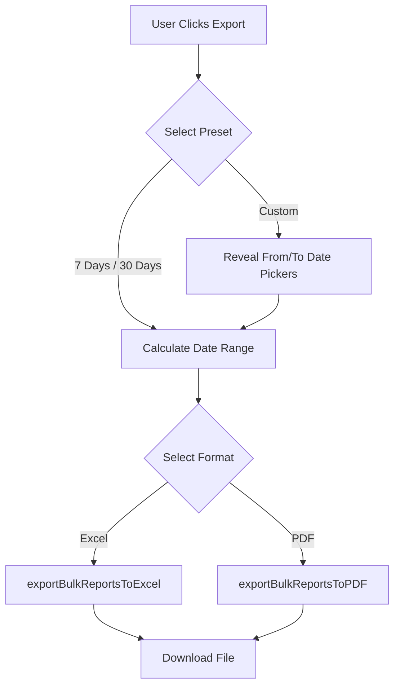
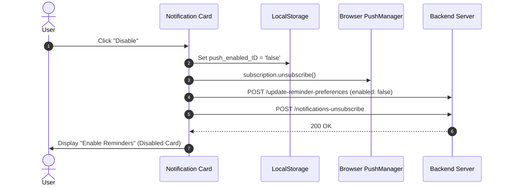

# 📜 Changelog - SadhanaGPT React Web

All notable changes, UI redesigns, architectural updates, and bug fixes for the **SadhanaGPT React Web App** are documented in this file.

---

## 🐛 [Fix] - 2026-10-03, 08:50 PM IST

- **Developer**: Manvatar Prabhu Ji
- **What changed**: The chatbot microphone now uses the browser's own voice typing on every device (Android, iPhone, desktop). It no longer records audio and sends it to our server, which was failing with an error right after tapping Stop. Spoken words now appear in the box while speaking. The mic closes by itself when you stop talking, after 60 seconds at most, or when you tap it again. If a browser does not support voice typing, the mic button is hidden and the user types instead.
- **Files touched**: `src/sadhna-assistant/components/NLInputBar.jsx`, `CHANGELOG.md`

---

## 🧪 [Test] - 2026-10-03, 06:52 PM IST

- **Developer**: Manvatar Prabhu Ji
- **What changed**: Added a temporary test. A browser alert saying "hello from claude" now shows when the login page (`/`) opens. Remove after testing.
- **Files touched**: `src/pages/Login.jsx`, `CHANGELOG.md`

---

## 🚀 [v1.2.0] - 2026-09-27

### 🎨 Features & Redesigns

#### 1. Export Students Modal Redesign
- **Unified Bottom-Sheet Interface**: Replaced outdated inline export dialogs with a modern glassmorphism bottom-sheet modal across:
  - Student Analytics (`/student/analytics`)
  - Counselor Analytics & Report Settings (`/counsellor/analytics`)
  - Counselor Group Mentees (`/counsellor/group-mentees`)
- **Preset & Custom Date Controls**: Added quick date preset chips (`7 Days`, `30 Days`, `Custom`).
- **Conditional Custom Date Pickers**: `From Date` and `To Date` inputs are smoothly revealed **only when `Custom` date preset is selected** via Framer Motion `<AnimatePresence>`.
- **Card-Based Format Selection**: Interactive option cards for **Excel (`.xlsx`)** and **PDF (`.pdf`)** export with active state indicators and descriptions.

---

### 🐛 Bug Fixes & Stability

#### 1. Group Mentees Route Export Crash Fix
- **Issue**: Refreshing `http://localhost:5173/counsellor/group-mentees` and clicking Export rendered a blank screen.
- **Root Cause**: `exportFormat` and `setExportFormat` were referenced in the export modal JSX but missing from state declarations in `GroupMenteesList.jsx`, causing an uncaught `ReferenceError`.
- **Fix**: Declared `const [exportFormat, setExportFormat] = useState('EXCEL')` and added fallback center auto-fetch (`/group-list`) when refreshing without location state.

#### 2. Push Notification Preference Persistence Sync
- **Issue**: Disabling push notifications on the dashboard automatically flipped back to "Reminders Enabled" upon page refresh or background status checks.
- **Root Cause**: Disabling push notifications locally unsubscribed browser WebPush but did not notify the backend server (`/update-reminder-preferences`, `/notifications-unsubscribe`), leading `/check-push-status` to return `isSubscribed: true`.
- **Fix**:
  - Updated `handleDisableNotifications` in `NotificationReminderSection.jsx` to call `/update-reminder-preferences` (`reminder_enabled: false`, `reminder_status: 0`) and `/notifications-unsubscribe`.
  - Updated `checkSubscription` in `StudentDashboard.jsx` and `CounsellorDashboard.jsx` to strictly preserve local `localStorage.getItem('push_enabled_' + userId) === 'false'`.

#### 3. Standardized ChatGPT Integration & Auto-Clipboard Copy
- **Issue**: Direct URL navigation to ChatGPT (`chatgpt.com/?q=...`) left raw prompt text sitting in the bottom input box after auto-submitting.
- **Fix**:
  - Updated `openChatGPTWithPrompt` in `chatGptUtils.js` to use `https://chatgpt.com/?hints=search&q=...` for automatic query submission.
  - Added automatic **Clipboard Copy** (`navigator.clipboard.writeText`) on redirect so the user always has a local backup copy of the prompt.
  - Standardized ChatGPT redirection across `GroupMenteesList`, `MenteesList`, `CounsellorAnalytics`, `StudentReport`, and `AIChat`.

---

## 🛠️ [v1.1.0] - 2026-09-20

### 🌟 Added
- Counselor Group & Sub-Group management modules.
- Multi-mentee bulk Sadhana analysis with ChatGPT AI prompt construction.
- Responsive mobile bottom navigation bars (`StudentBottomNavigation` & `CounsellorBottomNavigation`).

---

## 📌 Maintenance Notes
- Always run `cmd /c npm run build` to verify production compilation after modifying modals or state hooks.
- Refer to `.agents/rules/project-standards.md` for coding conventions and state preservation rules.
