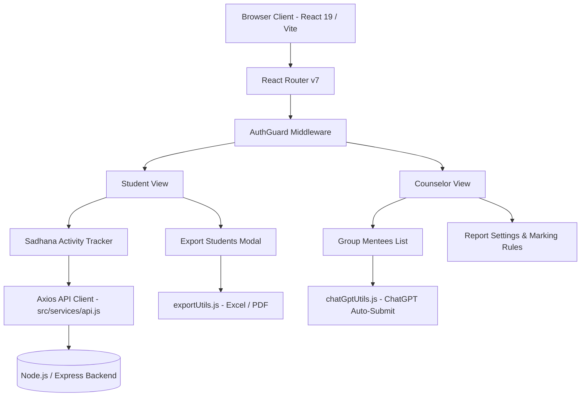

# 🌸 SadhanaGPT React Web Frontend

A modern, high-performance React 19 web application for tracking Sadhana activity logs, mentee analytics, spiritual counseling reports, and AI-powered performance insights.

---

## 🌟 Key Features

- **📊 Student Dashboard & Sadhana Tracker**: Log daily spiritual activities, view performance scores, rank splashes, and 7-day/30-day trends.
- **👥 Counselor Group & Mentee Management**: Group & sub-group (label) categorization, mentee progress monitoring, and individual/bulk mentee management.
- **📥 Universal Export System**: Export student sadhana reports to formatted **Excel (`.xlsx`)** and **PDF (`.pdf`)** files with custom date ranges.
- **🤖 AI Analysis & ChatGPT Integration**: One-click data aggregation and redirect to ChatGPT with auto-submitted prompts and automatic clipboard backup.
- **🔔 Real-Time Push Notifications**: WebPush reminder system synced between local storage, browser service workers, and backend API endpoints.

---

## 📐 System Architecture



---

## 📁 Directory Layout

```
reactweb/
├── .agents/                   # Custom agent guidelines & system rules
│   └── rules/
│       ├── project-standards.md
│       └── export-and-ai-rules.md
├── src/
│   ├── components/            # Reusable UI components
│   │   ├── AiAnalysis/        # AI Date Filter & Analysis Modals
│   │   ├── counsellor/        # Counselor Navigation & Report Settings
│   │   ├── shared/            # AuthGuard, Notifications Panel, Cards
│   │   └── student/           # Student Export Modal, Navigation
│   ├── pages/                 # Main page views
│   │   ├── counsellor/        # Counselor Dashboard, Group Mentees, Reports
│   │   └── student/           # Student Dashboard, Analytics, AI Chat
│   ├── routes/                # AppRoutes.jsx - Central route registry
│   ├── services/              # API layer (api.js, aiDataCollectorService.js)
│   └── utils/                 # Export utilities (exportUtils.js, chatGptUtils.js)
├── CHANGELOG.md               # Version history and visual release notes
└── README.md                  # Project overview & documentation
```

---

## 🚀 Quick Start

```bash
# 1. Install dependencies
npm install

# 2. Start development server
npm run dev

# 3. Build for production
cmd /c npm run build
```

The application will launch on `http://localhost:5173`.

---

## 📖 Rules & Guidelines
- See [CHANGELOG.md](./CHANGELOG.md) for recent updates and bug fixes.
- See [.agents/rules/project-standards.md](./.agents/rules/project-standards.md) for UI preservation & architecture standards.
- See [.agents/rules/export-and-ai-rules.md](./.agents/rules/export-and-ai-rules.md) for Export modal and ChatGPT redirection rules.
